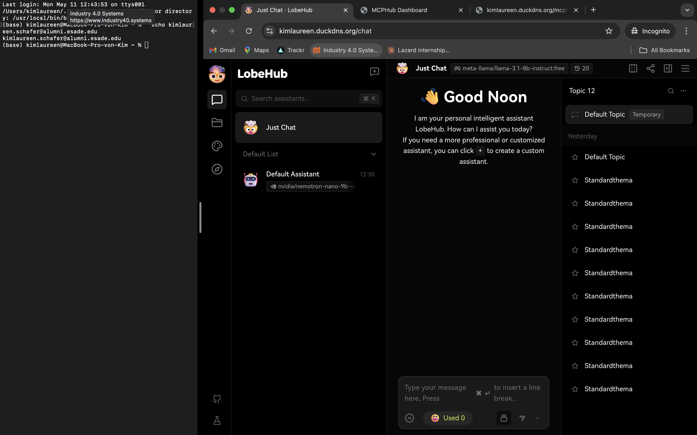
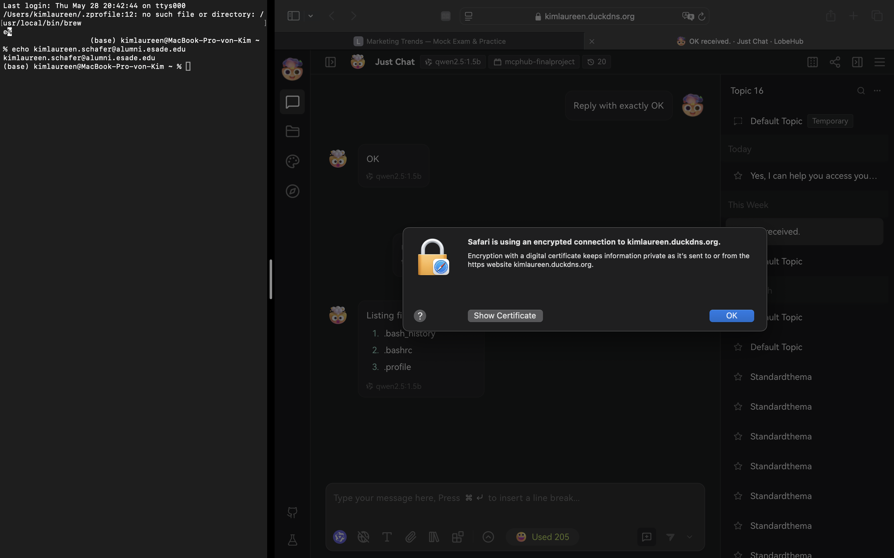
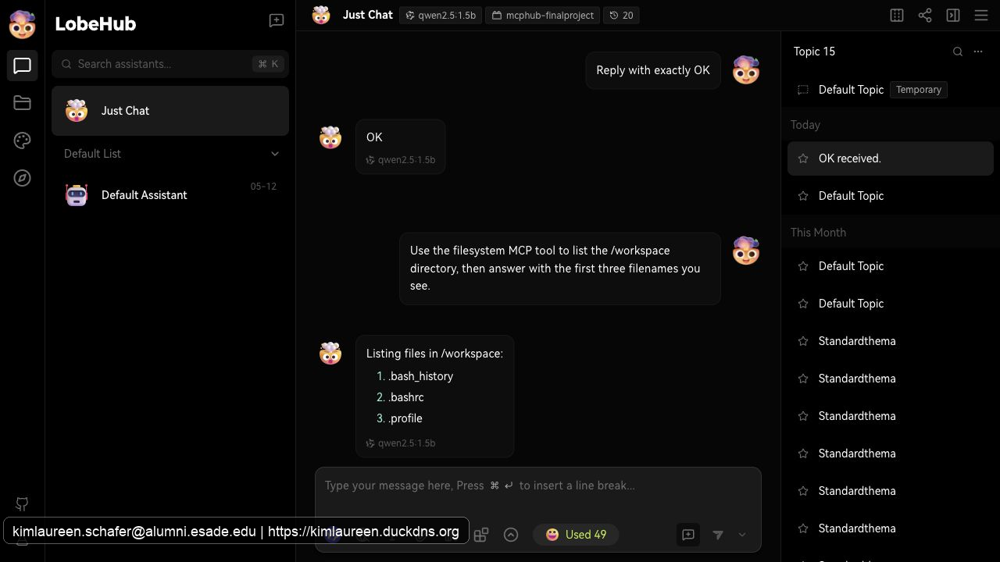
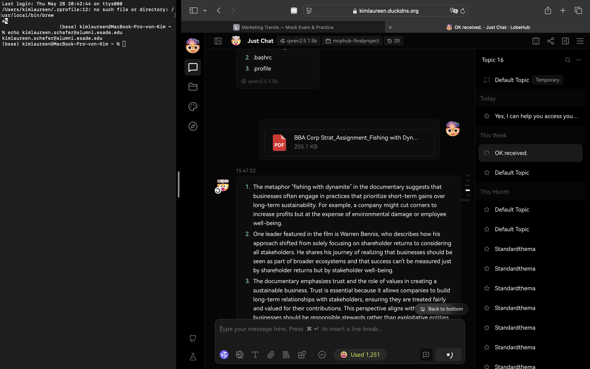

# Final Project — Evidence Report

## 1. Identity

| Field | Value |
|---|---|
| Student name | Kim Schäfer |
| ESADE email | kimlaureen.schafer@alumni.esade.edu |
| GitHub repo URL | https://github.com/kimlaureen/lobechat-aws (private; `joseporiolrius` invited as collaborator) |
| Latest commit SHA | `67485c6965ce0df9db2d30cabda4055d5de24af4` |
| Final tag | `final-v0.7.0` |

## 2. Public URL

**[https://kimlaureen.duckdns.org](https://kimlaureen.duckdns.org)**

## 3. Screenshot — LobeChat over HTTPS, logged in



*LobeChat at `kimlaureen.duckdns.org` with ESADE email visible in terminal. Certificate: Let's Encrypt, connection secure.*



## 4. Screenshot — chat working (streaming + MCP)



## 5. Screenshot — file upload to MinIO



*A PDF upload is visible in the chat and LobeChat responds below it, validating the file upload path through MinIO.*

## 6. Public reachability — `curl -sI https://<host>/`

```
$ curl -sI https://kimlaureen.duckdns.org/
HTTP/2 307 
alt-svc: h3=":443"; ma=2592000
date: Sat, 30 May 2026 13:50:40 GMT
location: /chat
via: 1.1 Caddy
```

## 7. Negative test — port 47000 closed

```
$ curl -v --max-time 5 http://18.202.153.230:47000/
*   Trying 18.202.153.230:47000...
* Connection timed out after 5007 milliseconds
* Closing connection
curl: (28) Connection timed out after 5007 milliseconds
```

## 8. Stack runtime — `docker compose ps`

```
$ docker compose ps
NAME              IMAGE                               COMMAND                  SERVICE         CREATED       STATUS                 PORTS
caddy             caddy:2-alpine                      "caddy run --config …"   caddy           2 hours ago   Up 35 minutes          0.0.0.0:80->80/tcp, [::]:80->80/tcp, 0.0.0.0:443->443/tcp, [::]:443->443/tcp, 0.0.0.0:9000->9000/tcp, [::]:9000->9000/tcp, 0.0.0.0:47002->47002/tcp, [::]:47002->47002/tcp, 443/udp, 2019/tcp
casdoor           casbin/casdoor:v2.13.0              "/server /bin/sh -c …"   casdoor         2 hours ago   Up 2 hours
hayhooks          deepset/hayhooks:v1.1.0             "hayhooks run --host…"   hayhooks        2 hours ago   Up 2 hours             0.0.0.0:47012->1416/tcp, [::]:47012->1416/tcp
hayhooks-mcp      deepset/hayhooks:v1.1.0             "sh -c 'pip install …"   hayhooks-mcp    2 hours ago   Up 2 hours             1416/tcp, 0.0.0.0:47013->1417/tcp, [::]:47013->1417/tcp
linux-sandbox     lobechat-aws-linux-sandbox:latest   "tail -f /dev/null"      linux-sandbox   2 hours ago   Up 2 hours
lobe-chat         lobehub/lobe-chat-database          "/bin/node /app/star…"   lobe-chat       2 hours ago   Up 2 hours             3210/tcp
mcphub            lobechat-aws-mcphub:latest          "/usr/local/bin/entr…"   mcphub          2 hours ago   Up 36 minutes          0.0.0.0:47008->3000/tcp, [::]:47008->3000/tcp
minio             minio/minio:latest                  "/usr/bin/docker-ent…"   minio           2 hours ago   Up 2 hours (healthy)   9000/tcp
qdrant            qdrant/qdrant:latest                "./entrypoint.sh"        qdrant          2 hours ago   Up 2 hours (healthy)   0.0.0.0:47010->6333/tcp, [::]:47010->6333/tcp, 0.0.0.0:47011->6334/tcp, [::]:47011->6334/tcp
shared-postgres   pgvector/pgvector:pg16              "docker-entrypoint.s…"   postgres        2 hours ago   Up 2 hours (healthy)   0.0.0.0:47003->5432/tcp, [::]:47003->5432/tcp
```
