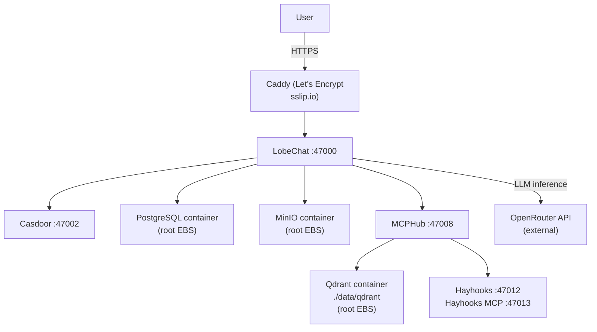
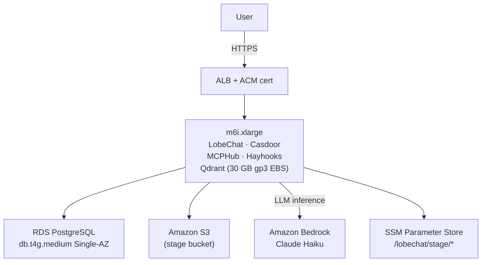
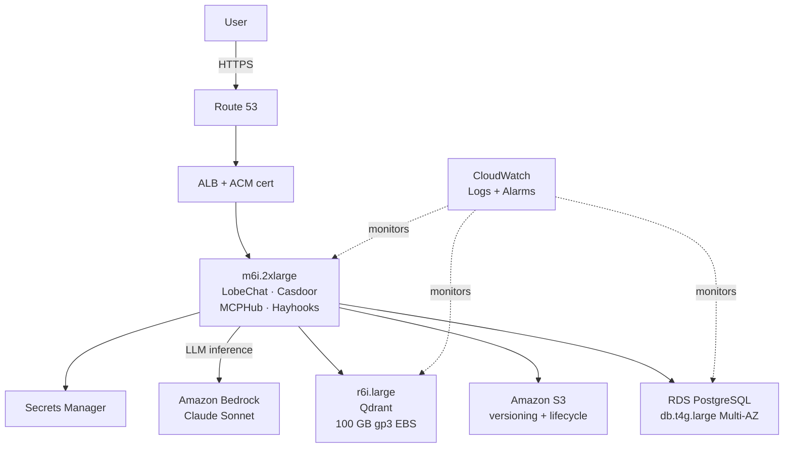

# Q2 — 3-environment architecture evolution

## Per-environment component table

| Component | Dev | Stage | Prod |
|-----------|-----|-------|------|
| **LobeChat** | Container, `t3.xlarge` | Container, `m6i.xlarge` | Container, `m6i.2xlarge` |
| **Casdoor** | Container, same EC2 | Container, same EC2 | Container, same EC2 as LobeChat |
| **PostgreSQL** | Container, root EBS | RDS `db.t4g.medium`, Single-AZ | RDS `db.t4g.large`, Multi-AZ |
| **MinIO / Storage** | Container, root EBS | Amazon S3 (separate bucket) | Amazon S3, versioning + lifecycle |
| **Qdrant** | Container, root EBS, no separate volume | Container, same EC2, **30 GB gp3 EBS** | Container, dedicated **`r6i.large`**, **100 GB gp3 EBS** |
| **MCPHub** | Container, same EC2 | Container, same EC2 | Container, same EC2 as LobeChat |
| **Hayhooks + MCP** | Container, same EC2 | Container, same EC2 | Container, same EC2 as LobeChat |
| **LLM provider** | OpenRouter API (no container) | Amazon Bedrock — Claude Haiku | Amazon Bedrock — Claude Sonnet |

vLLM is dropped in all three environments. It requires a GPU EC2 (`g5.2xlarge` ≈ $864/month) and contributes nothing that Bedrock or OpenRouter cannot replace via an identical OpenAI-compatible interface. The switch is three env vars; no code changes.

---

## Qdrant on EC2 — sizing, snapshots, recovery

The constraint to run Qdrant on EC2 in all three environments is justified by a concrete technical reason: Qdrant keeps its HNSW index in memory for low-latency nearest-neighbour search. No managed vector DB currently exposes the memory-sizing controls needed to predict query latency under a known corpus volume. Running on EC2 means you choose the instance and provision RAM explicitly.

**Sizing per environment.** Qdrant requires roughly 20 KB per stored chunk (6 KB raw float32 vector at 1536 dimensions plus HNSW graph overhead), and the index needs approximately 2× the raw vector data in RAM to serve queries without thrashing.

- **Dev:** corpus is the synthetic `docs/rag-demo/` set — a few hundred chunks, under 10 MB. Qdrant runs as a container on the shared `t3.xlarge`, data at `./data/qdrant` on the root EBS volume. No separate volume needed. No snapshot policy: data is synthetic and reproducible in minutes.
- **Stage:** 20,000–50,000 chunks (anonymised prod corpus). ~3–4 GB with index. Dedicated **30 GB gp3** attached volume (`/dev/xvdf`, mounted at `/data/qdrant`), separate from the root volume so it can be detached and reattached independently. AWS Data Lifecycle Manager (DLM) takes daily snapshots at 02:00 UTC, 7-day retention.
- **Prod:** up to 200,000 chunks for the consultancy use case from Q1 (client runbooks, post-mortems, architecture docs). ~12 GB index in memory. This drives the dedicated **`r6i.large`** (16 GB RAM) — if Qdrant shares the app-tier EC2, a MCPHub or Hayhooks memory spike can evict the index from RAM and send query latency from milliseconds to seconds. Dedicated instance eliminates that failure mode. EBS: **100 GB gp3**, AWS Backup daily snapshots at 01:00 UTC, 14-day retention.

**Recovery procedure.** EBS volumes survive EC2 instance failure. If the instance dies: launch a replacement in the **same Availability Zone** (EBS is AZ-scoped — wrong AZ means the volume cannot attach), re-attach the volume, restart the Qdrant container. No data loss, RTO under 10 minutes. A second recovery path covers EBS corruption: a daily cron calls `POST /collections/rag-demo/snapshots` and uploads the file to S3 (30-day retention, Glacier after 7 days). `PUT /collections/rag-demo/snapshots/recover` restores from S3 without touching the block device.

---

## AWS managed services in prod

Five managed services replace containerised components, each justified by a concrete failure mode:

1. **RDS PostgreSQL Multi-AZ** — Postgres carries LobeChat sessions, messages, agent configs, and Casdoor identity. A container storing this data on EBS with no automated backup means recovery after instance failure requires a manual snapshot restore. RDS gives point-in-time recovery (PITR) to any second within 14 days; Multi-AZ gives ~60-second automatic failover. Before every migration, a manual RDS snapshot creates an additional restore point from 2 minutes before the risky operation.

2. **Amazon S3** — MinIO is an S3-compatibility layer. Replacing it means changing three env vars (`S3_ENDPOINT`, `S3_BUCKET`, removing `S3_PATH_STYLE`). What it eliminates: the disk-fill-kills-Postgres failure mode, where MinIO fills the EBS root volume and Postgres writes begin failing. S3 versioning protects against accidental deletion of user-uploaded files; lifecycle rules archive old RAG corpus uploads cheaply.

3. **ALB + ACM** — Caddy on the EC2 handles TLS in dev, but two things break at prod scale. First, Hayhooks MCP uses SSE streams for long-running RAG pipelines — Caddy's default 30-second idle timeout drops mid-stream connections; ALB's idle timeout is configurable to 4000 seconds. Second, Casdoor's OAuth callback requires a valid cert independent of EC2 health; ACM certificates are renewed by AWS and never expire regardless of instance state.

4. **Secrets Manager** — The `.env` in this stack contains `KEY_VAULTS_SECRET` (decrypts every user's stored API key in Postgres), `NEXT_AUTH_SECRET`, Casdoor client secret, Postgres password, and provider API keys. Secrets Manager adds per-secret IAM access (MCPHub reads only its own secrets), CloudTrail audit logging of every access, and rotation support. If the OpenRouter key is compromised, one update propagates without redeployment.

5. **CloudWatch (Logs + Alarms)** — MCPHub logs every tool call. In a container without CloudWatch, those logs die with the EC2. CloudWatch Logs persists them across reboots and provides a searchable audit trail. Alarms on RDS connection count (LobeChat pool leak), ALB 5xx rate (service crash), and EC2 CPU (Hayhooks pipeline stuck) give actionable signals without SSH access.

Route 53 and a hosted zone complete the prod setup, wiring the custom domain to the ALB and enabling ACM DNS validation.

---

## Promotion flow

One protected branch (`main`), short-lived feature branches, environments driven by **git tags** — not separate branches. Commitizen handles tagging: `cz bump` reads conventional commits since the last tag and increments semver automatically.

**Dev** deploys automatically on every merge to `main`. GitHub Actions SSHes into the dev EC2, runs `./db/migrate up`, then `docker compose up -d`. No approval, no gate.

**Stage** deploys when a semver tag is pushed (`cz bump` → `git push --tags`). The Actions workflow deploys to the stage EC2 fetching secrets from `/lobechat/stage/*` in SSM. After deploy, a manual checklist confirms: Casdoor login completes through ALB, LobeChat SSE streaming works, at least one MCP tool returns a result, file upload to S3 succeeds. Stage is the human gate before prod.

**Prod** requires a second `cz bump` tag and a manual approval click in GitHub Actions (Environment protection rule on the `production` environment). The workflow fetches `/lobechat/prod/*` secrets, runs migrations, restarts containers. The approval is logged in the Actions audit trail. Database migrations always run before containers restart — if `./db/migrate up` fails, old containers stay up. Config changes to `config/mcp_settings.json` trigger an explicit `docker compose restart mcphub` step.

---

## Data strategy

**Dev** data is generated, never derived from prod. `db/seed.sql` provides schema-valid synthetic rows; a small script generates fake users, conversations, and agent configs at realistic volume. Qdrant is populated with the `docs/rag-demo/` corpus via OpenRouter's embedding API on first boot. No prod dependency, no anonymisation risk.

**Stage** refreshes weekly from prod. An RDS snapshot restores to the stage instance, then an anonymisation script runs immediately: user emails and names are replaced with `user_<id>@example.com`; message content is redacted; `key_vaults` blobs are structurally present but unreadable because stage uses a different `KEY_VAULTS_SECRET`. Qdrant is refreshed on demand by restoring the latest prod collection snapshot from S3 via the `snapshots/recover` API.

**Prod** backup: RDS automated backups (14-day PITR) plus a manual snapshot before every migration. Qdrant: daily EBS snapshots via AWS Backup (14-day retention) plus daily collection snapshots to S3 (30-day retention). S3 uploads: versioning enabled, accidental deletion recoverable. RTO for Postgres: 15–30 minutes (PITR restore). RTO for Qdrant: under 10 minutes (EBS reattach) or 20–40 minutes (S3 collection snapshot recover).

---

## Trade-off table

| | **Dev** | **Stage** | **Prod** |
|---|---|---|---|
| **Reliability** | Low — single EC2, no backups, full data loss on instance failure | Medium — RDS survives instance failure; app tier still a SPOF | High — Multi-AZ RDS failover, S3 durability, two-path Qdrant recovery; app tier EC2 remains a single point of failure |
| **Monthly cost** | ~$100 (t3.xlarge + OpenRouter) | ~$300 running / ~$30 idle (stop EC2 between test cycles) | ~$800 baseline + Bedrock token variable |
| **Ops complexity** | Low — `docker compose up -d` after git pull; one server | Medium — RDS endpoint in SSM, S3 CORS, ALB health checks, data refresh, migration testing | High — CloudWatch alarm tuning, Secrets Manager, EBS snapshot verification, migration runbooks, rollback procedures |

The non-obvious trade-off: stage's $300/month drops to $30 when stopped between test cycles. Treating stage as on-demand rather than always-on collapses its cost without changing its architecture. Prod's ~$800 fixed baseline is the real break-even question — below roughly 30 active users, buying ChatGPT Enterprise at $30/user/month is cheaper. Above that threshold, self-hosting wins on both cost and data sovereignty.

---

## Reverse-proxy / TLS choice

- **Dev:** Caddy on the same EC2 (the repo already includes a `Caddyfile`). Automatic Let's Encrypt via `sslip.io` or DuckDNS — zero config, handles Casdoor OAuth callbacks over HTTPS. Let's Encrypt staging cert during setup, switch to production cert before demo.
- **Stage and Prod:** ALB + ACM. ACM certificates never expire (AWS manages renewal independently of EC2 health). ALB handles WebSocket upgrades and configurable SSE idle timeouts — both required for MCPHub streaming and Hayhooks MCP. ALB also sits outside the EC2, so a 502 is returned immediately on instance failure rather than a TCP hang, which CloudWatch can alarm on.

The choice against API Gateway: its proxy model does not cleanly handle the SSE and WebSocket connections that LobeChat and Hayhooks MCP depend on.

---

## Architecture diagrams

**Dev — single EC2, full Docker Compose**

**Stage — managed data tier, single app EC2**

**Prod — isolated Qdrant, managed services, full observability**

