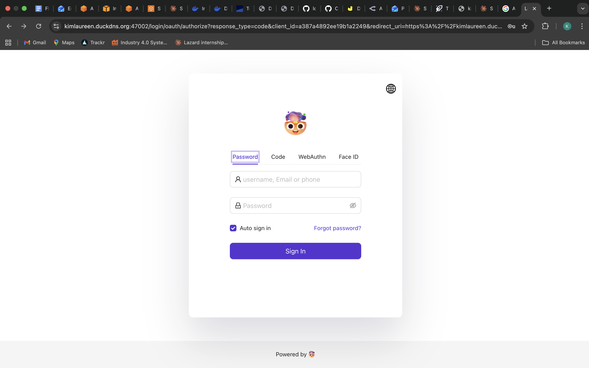

# TLS Validation Checklist

Appendix A.4 requires proof that the public HTTPS hostname carries the full
LobeChat workflow, not only a green padlock.

**Public URL:** https://kimlaureen.duckdns.org  
**Student:** Kim Schäfer — kimlaureen.schafer@alumni.esade.edu  
**Region:** `eu-west-1`  
**EC2 instance:** `i-07ac5f31a6975d3c2` (`lobechat-server`)

## Final Checklist

| Check | Status | Evidence |
|---|---:|---|
| Casdoor login flow completes from the public URL, with no `Secure cookie` or `redirect_uri` errors. | Passed | `casdoor-login.png`, captured `2026-05-12 13:06:28 CEST` |
| LobeChat chat streaming works over HTTPS. | Passed | `chat-mcp.png`, captured `2026-05-30 15:46:26 CEST`; response visible in chat after prompt submission. |
| At least one MCP tool invoked from chat returns a result. | Passed | `chat-mcp.png`, captured `2026-05-30 15:46:26 CEST`; filesystem MCP result lists `/workspace` entries. |
| File upload to MinIO from chat works. | Passed | `file-upload.png`, captured `2026-05-30 15:50:34 CEST`; uploaded PDF is visible in chat and LobeChat responds using it. |
| Direct connection to EC2 origin is rejected, not served directly. | Passed | `curl` to `http://18.202.153.230:47000/` timed out on `2026-05-30`; `http://18.202.153.230:443/` returned `400 Bad Request` because the port expects HTTPS. |
| Browser shows a valid certificate chain on the public hostname. | Passed | `tls-cert.png`, captured `2026-05-30 15:46:55 CEST`; Safari reports an encrypted connection to `kimlaureen.duckdns.org`. |

## Screenshots

### 1. Casdoor Login



### 2. Streaming Chat + MCP Tool Result


### 3. Valid Certificate Chain


### 4. File Upload To MinIO


## Command Evidence

### Public Reachability

Captured from the laptop against the public hostname:

```bash
$ curl -sI https://kimlaureen.duckdns.org/
HTTP/2 307
alt-svc: h3=":443"; ma=2592000
date: Mon, 11 May 2026 11:59:39 GMT
location: /chat
via: 1.1 Caddy
```

### Direct Origin Rejection

```bash
$ curl -v --max-time 5 http://18.202.153.230:47000/
*   Trying 18.202.153.230:47000...
* Connection timed out after 5007 milliseconds
* Closing connection
curl: (28) Connection timed out after 5007 milliseconds
```

The public IP is an Elastic IP, so it remains stable across instance restarts.
The LobeChat app is not served directly on `:47000`; users should reach it only
through `https://kimlaureen.duckdns.org`.

The proxy hostname must also be required for HTTPS. A direct HTTP request to the
EC2 IP on port `443` is rejected by the TLS listener:

```bash
$ curl -v --max-time 5 http://18.202.153.230:443/
*   Trying 18.202.153.230:443...
* Connected to 18.202.153.230 (18.202.153.230) port 443
> GET / HTTP/1.1
> Host: 18.202.153.230:443
> User-Agent: curl/8.7.1
> Accept: */*
>
< HTTP/1.0 400 Bad Request
Client sent an HTTP request to an HTTPS server.
```

### File Upload To MinIO

The browser upload path was validated from chat. Screenshot
`file-upload.png`, captured `2026-05-30 15:50:34 CEST`, shows a PDF attached in
the LobeChat conversation and a model response below it.

## Notes

- MCP is validated separately from upload: `chat-mcp.png` proves MCP transport
  through Caddy works.
- File upload validates the LobeChat-to-MinIO/S3 path and proxy request-size /
  timeout behavior.
- The live MinIO bucket exists and the running LobeChat container signs uploads
  against `https://kimlaureen.duckdns.org:9000`, matching the public browser
  upload endpoint.
