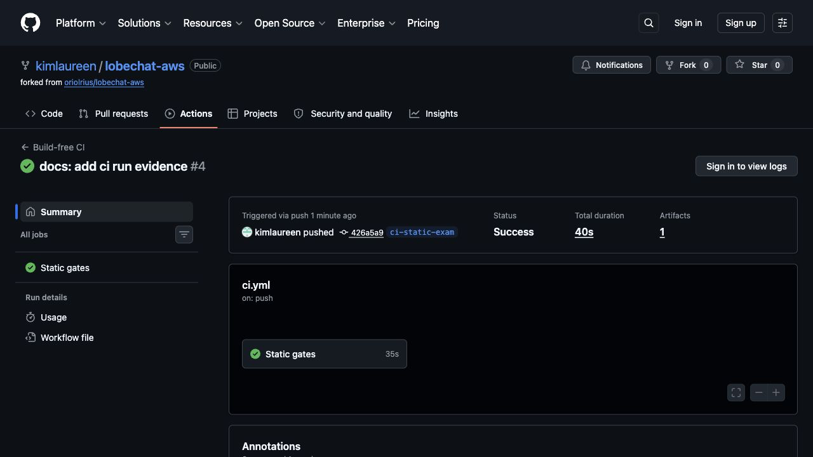
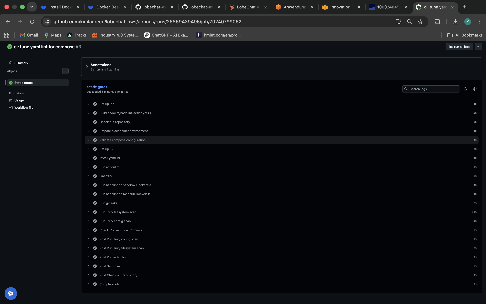

# Build-free CI Reasoning

Supplemental gate-list evidence:

Actions run URL: https://github.com/kimlaureen/lobechat-aws/actions/runs/26869659345

Commit SHA: 426a5a971ea7139ac39e6069668be641cc2a26dd

## Part A - Why What I Did Matters

This workflow is intentionally build-free. The exam repository represents an 11-service application graph, and the existing tests still target live services such as vLLM rather than isolated units. In this fork, `tests/test_vllm.py:9` imports `httpx`, `tests/test_vllm.py:11` imports `OpenAI`, and `tests/test_vllm.py:33` calls the live `/health` endpoint. Those tests belong in a post-deploy or ephemeral-environment stage, not in this static CI.

For Compose validation, `docker compose -f docker-compose.yml config -q` checks schema and interpolation without starting services. The file requires secrets such as `NEXT_AUTH_SECRET`, `AUTH_CASDOOR_ID`, `AUTH_CASDOOR_SECRET`, `KEY_VAULTS_SECRET`, and `OPENROUTER_API_KEY` in `docker-compose.yml:49`, `docker-compose.yml:54`, `docker-compose.yml:55`, `docker-compose.yml:67`, and `docker-compose.yml:69`. The workflow copies `.env.example` to `.env` only inside the runner. That is safe because `.env.example` uses placeholders like `.env.example:3`, and the real `.env` is ignored by `.gitignore:8`. I am not claiming gitleaks found committed secrets; the point is to prevent future accidental leaks.

Hadolint matters because both local Dockerfiles carry supply-chain and hardening risks. `dockerfiles/mcphub.Dockerfile:1` pulls `samanhappy/mcphub:latest`, so the base image can change under the same CI input. The same Dockerfile switches to root at `dockerfiles/mcphub.Dockerfile:5` and adds `gcc` plus `docker.io` at `dockerfiles/mcphub.Dockerfile:7`, widening the runtime attack surface. In `dockerfiles/sandbox.Dockerfile:21`, the `oriol` user gets NOPASSWD sudo. The same file downloads `kubectl`, `eksctl`, and `zellij` from latest/stable URLs at `dockerfiles/sandbox.Dockerfile:43`, `dockerfiles/sandbox.Dockerfile:50`, and `dockerfiles/sandbox.Dockerfile:62`, with no checksum verification.

Trivy config matters because the Compose file contains deployment risks that are visible without running containers. `lobe-chat` has no immutable image tag at `docker-compose.yml:37`, while `ollama`, `qdrant`, `minio`, and `minio-init` use `:latest` at `docker-compose.yml:97`, `docker-compose.yml:136`, `docker-compose.yml:179`, and `docker-compose.yml:196`. The `mcphub` service image at `docker-compose.yml:109` is locally built; the unpinned pull risk for it is the Dockerfile `FROM`, not that compose service.

Trivy fs matters because it inspects the repository as a filesystem, including Dockerfiles, Compose, scripts, and dependency manifests. In this repo that includes the Python dev/test dependency declaration in `pyproject.toml:7`, and the test dependencies `openai` and `httpx` in `pyproject.toml:13`. It gives an offline vulnerability signal before any image build exists.

Gitleaks matters because this stack is secret-heavy by design. Secrets are passed as plaintext environment variables for LobeChat and Casdoor in `docker-compose.yml:49`, `docker-compose.yml:55`, and `docker-compose.yml:67`. `.gitignore` already excludes `.env`, `aws_credentials.yaml`, `*.pem`, and `config/ssh/` at `.gitignore:8`, `.gitignore:19`, `.gitignore:20`, and `.gitignore:29`, so this gate is about regression prevention, not about inventing leaks.

Yamllint and actionlint matter because this repository previously had no `.github/` CI at all, so a broken workflow would silently block the whole exam deliverable. Yamllint checks both `docker-compose.yml:1` and the workflow itself, while actionlint verifies the GitHub Actions syntax.

The Commitizen check matters because the repository already has a local Conventional Commits gate in `.githooks/commit-msg:13`. The workflow mirrors that intent with `uv run cz check`, bounded to `origin/main..HEAD` so pre-existing history does not fail this new CI.

## Part B - What Is Missing For Real Production CI/CD

What I built is Continuous Integration: static quality, syntax, security, and convention gates that run on push and pull request. It stops before Continuous Delivery or Continuous Deployment because it does not build artifacts, publish images, provision cloud resources, migrate production databases, deploy services, or run smoke tests against a real environment.

1. Build and publish immutable images. The local images `lobechat-aws-mcphub:latest` and `lobechat-aws-linux-sandbox:latest` are defined at `docker-compose.yml:109` and `docker-compose.yml:216`, but this CI never builds, signs, generates SBOMs for, or pushes them to a registry such as ECR. A real CD pipeline would publish versioned digests and deploy those exact digests.

2. Resolve floating upstream images. `lobe-chat` is untagged at `docker-compose.yml:37`, and several services use `:latest` at `docker-compose.yml:97`, `docker-compose.yml:136`, `docker-compose.yml:179`, and `docker-compose.yml:196`. Production CD needs digest pinning so rollback and audit mean something.

3. Use AWS OIDC instead of standing credentials. `.env.example` still documents optional AWS key placeholders at `.env.example:60`, `.env.example:61`, `.env.example:62`, and `.env.example:63`. A production pipeline should federate GitHub Actions to AWS with OIDC and scoped IAM roles instead of carrying long-lived keys.

4. Inject runtime secrets from a managed secret store. LobeChat, Casdoor, OpenRouter, MinIO, and SSH-related values are all expressed as environment variables in `docker-compose.yml:49`, `docker-compose.yml:69`, `docker-compose.yml:114`, and `docker-compose.yml:126`. CD should pull them at deploy time from SSM Parameter Store or Secrets Manager and never bake them into repository files or image layers.

5. Add a guarded database migration stage. The Flyway toolchain handles `lobechat`, `casdoor`, and `litellm` databases in `db/flyway/provision.sh:17`, but it can also run a destructive `clean` path at `db/flyway/provision.sh:68`. A real pipeline needs migration dry-run/info, backup/restore policy, and manual approval before destructive operations.

6. Add environment promotion with protected approvals. The current CI has only one static job and no concept of dev, stage, or prod. Production delivery needs GitHub environments with required reviewers before deployment, especially because the final project requires keeping direct port 47000 closed and serving through the reverse proxy, as stated in `docs/FINAL-PROJECT.md:163`.

7. Add a deploy mechanism to the EC2 target. The repository has shell deployment assets such as `infra/deploy.sh:1` and `infra/userdata.sh:1`, but this workflow deliberately never calls them. CD needs a controlled target path such as SSM Run Command or a locked-down SSH deploy that pulls pinned images and restarts only approved services.

8. Add post-deploy health and smoke gates. Compose currently defines healthchecks for `qdrant`, `minio`, and `postgres` at `docker-compose.yml:144`, `docker-compose.yml:189`, and `docker-compose.yml:236`, but key services such as `lobe-chat`, `casdoor`, and `mcphub` do not have equivalent health gates. Live tests such as `tests/test_mcp_playwright.py:20` should run only after an ephemeral or deployed stack exists.

9. Bake the LobeChat patch into a pinned artifact. The current stack bind-mounts `patches/route.js:1` over application internals at `docker-compose.yml:41`. A real release should fork or extend the app image, apply the patch at build time, test it, and deploy the resulting image digest.

10. Protect the release process. The repo’s versioning is managed by Commitizen in `pyproject.toml:17`, with release tags formatted as `final-v$version` at `pyproject.toml:23`. Production CD should require branch protection, required checks, reviewed PRs, and signed release tags before deployment.

The single highest-value next step toward real CD is to create a release-image stage for the two local images and replace floating image references with immutable digests. That unlocks reproducible deploys, meaningful rollbacks, image scanning against the actual artifacts, and a cleaner path to EC2 deployment without needing to run the full stack during every pull request.
